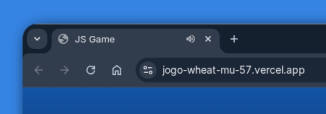

# Jogo do Número Secreto 🕹

Linguagem de programação utilizada: `Javascript`

## Descrição
Trata-se de um programa/site para jogar/brincar de adivinhar um número de 1 a 10.

## Como Acessar
O acesso ao jogo é feito através do link https://jogo-wheat-mu-57.vercel.app/

## Pré-requisitos para o Responsive Voice / Leitor de Tela em Voz Alta
***Antes de iniciar, assegure de acessar pelo navegador Google Chrome pois aparecerá uma tela de permissão para a execução do áudio do site, conforme a tela abaixo.***

### Permissão para executar áudio da tela do jogo no Google Chrome, clique em `Allow`.

### Note que o simbolo de áudio na aba está ativo no Google Chrome.

### Primeira tentativa

### Segunda tentativa, acertei o número secreto! ✌🏽

